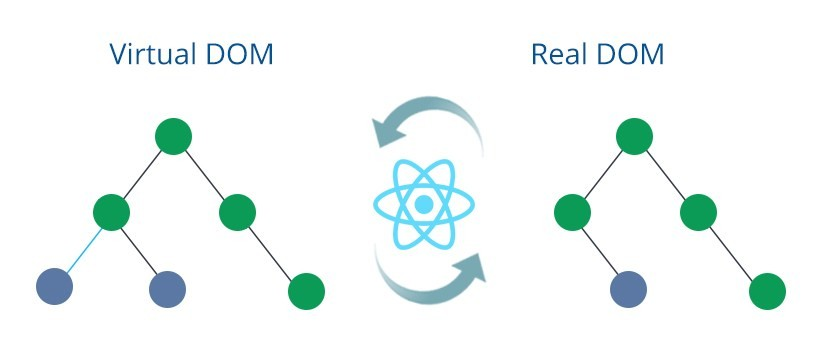
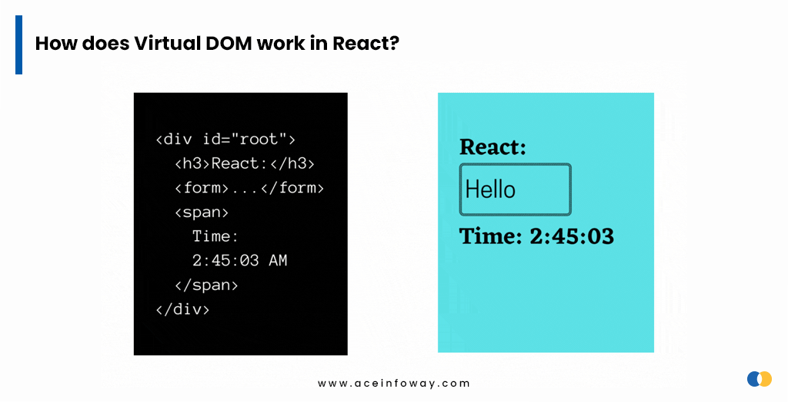
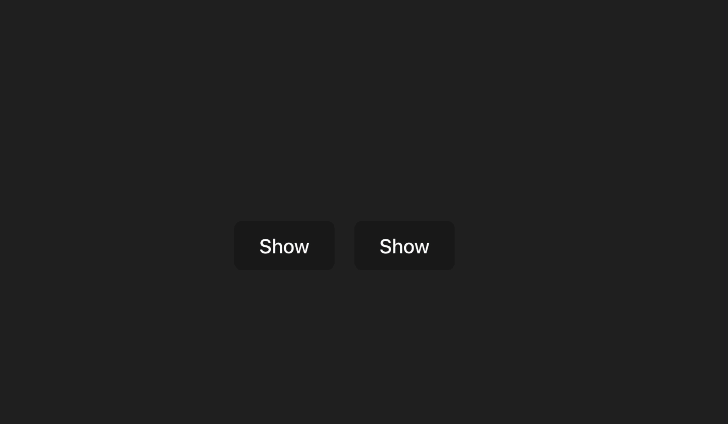

<h1>React JS</h1>


- [1. Introduction to React](#1-introduction-to-react)
  - [1.1. File Structure](#11-file-structure)
  - [1.2. Virtual DOM](#12-virtual-dom)
    - [1.2.1. Reconciliation](#121-reconciliation)
- [2. Small React Projects \& Hooks](#2-small-react-projects--hooks)
  - [2.1. Background Color Change Project](#21-background-color-change-project)
  - [2.2. useState Hook](#22-usestate-hook)
    - [2.2.1. Why use useState?](#221-why-use-usestate)
    - [2.2.2. Async behavior of useState](#222-async-behavior-of-usestate)
    - [2.2.3. Affect of primitives \& non-primitives on useState](#223-affect-of-primitives--non-primitives-on-usestate)
  - [2.3. useEffect Hook](#23-useeffect-hook)
  - [2.4. useRef Hook](#24-useref-hook)
  - [2.5. Custom Hooks](#25-custom-hooks)
    - [2.5.1. Sharing State Between Components](#251-sharing-state-between-components)
- [3. React APIs](#3-react-apis)
  - [3.1. forwardRef](#31-forwardref)

## 1. Introduction to React

- Developed by Facebook.
- One of the trifecta (React, Angular, Vue).
- Uses functional components to render DOM dynamically.
- Single page application.
- Only rerenders those parts of the page that have changed, avoids unnecessary rerendering of unchanged DOM elements.

### 1.1. File Structure

File structure might change from one project to another. However, what we use in the current project is somewhat looks like this,

```
api/
  APIUtils.js
  APIUtils.test.js
  ProfileAPI.js
  UserAPI.js
components/
  Avatar.js
  Avatar.css
  Feed.js
  Feed.css
  FeedStory.js
  FeedStory.test.js
```

This is also supported by [react's official documentation](https://legacy.reactjs.org/docs/faq-structure.html).

### 1.2. Virtual DOM



DOM(Document object model) is a model that represents HTML content of a website. The browser compiles the HTML code to create tree of objects, which is called DOM.

This model restructures the HTML code as nodes. Through this representation, developers are allowed to manipulate the HTML content of a website.

```js
function disableInput() {
  const inputElement = document.getElementById("myInput");
  inputElement.disabled = true;
}
```

Here, this javascript function selects `myInput` element from `document` and disables it. Here, document refers to the `DOM`.

`Virtual DOM` is the lightweight version of the real DOM, which works as an API to make changes on the real DOM.

The main reasons why we use Virtual DOM are:

- It's a lightweight version of DOM, holds less space.
- It makes changes in DOM as effectively as possible, hence increasing the app performance.



#### 1.2.1. Reconciliation

React uses a diffing algorithm to determine when to update real DOM. This is called `reconciliation`.

Find more on reconciliation [here](https://legacy.reactjs.org/docs/reconciliation.html).

## 2. Small React Projects & Hooks

### 2.1. Background Color Change Project

I made this small first project through some research on web and react documentation.


Here, I have two components in default exported component,

```js
return (
  <div className="button-container">
    <ColorChangeButton />
    <ResetColorButton />
  </div>
);
```

Here, I use `useState`, and `useEffect` hooks to hold and change the state of current color, and trigger `changeBackgroundColor` function when the state of current color changes.

### 2.2. useState Hook

In React, any function that start with `use` prefix is called a Hook, e.g., `useState`.

useState Hook is a special hook that returns a variable and a function.

<b>variable</b>: whose state is being changed</br>
<b>function</b>: with which we set the new state of the variable.

```ts
export default function App = () => {
const [buttonPressed, setButtonPressed] = useState(false);
const [resetPressed, setResetPressed] = useState(false);
const [pressCount, setPressCount] = useState(0);
const [currentColor, setCurrentColor] = useState(originalColor);

...
...

function ColorChangeButton() {
    return (
      <button
        onClick={() => {
          setButtonPressed(true);
          setResetPressed(false);
          setCurrentColor(colorList[pressCount]);
          setPressCount((pressCount + 1) % colorList.length);
        }}
      >
        {buttonPressed && !resetPressed
          ? "Current color is " + `${currentColor}`
          : "Change Background Color"}
      </button>
    );
  }

  return (
    <div className="button-container">
      <ColorChangeButton />
      <ResetColorButton />
    </div>
  );
}
```

This is a basic use of `useState` Hook in react.

#### 2.2.1. Why use useState?

- <strong>Local variables don’t persist between renders.</strong> When React renders this component a second time, it renders it from scratch—it doesn’t consider any changes to the local variables.
- <strong>Changes to local variables won’t trigger renders.</strong> React doesn’t realize it needs to render the component again with the new data.

TLDR: `Always refrain from declarations like let pressCount: number = 0` as the pressCount will be redeclared with each rendering.

#### 2.2.2. Async behavior of useState

`useState` updates variables asyncronously. [This](https://stackoverflow.com/questions/54069253/the-usestate-set-method-is-not-reflecting-a-change-immediately) is a question regarding this and the answers are to the point.

The async behavior of `useState` can be seen in the following snippet

```ts
export default function CounterButton() {
  const [count, setCount] = useState(0);

  useEffect(() => {
    setCount(count + 1);
    setCount(count + 1);
    setCount(count + 1);
    setCount(count + 1);
    setCount(count + 1);
    setCount(count + 1);
    setCount(count + 1);
    console.log(count);
  }, []);

  return (
    <>
      <button
        onClick={() => {
          setCount(count + 1);
        }}
      >
        Counter : {count}
      </button>
    </>
  );
}
```

Here, useEffect fires when app first mounted. However, setCount does not immediately update `count` value. It is updated in the next render. So, since the initial value is 0, count value remain 0 until the next re-render.

This is why, we see the `Counter : 1`, console.log -> 0.


#### 2.2.3. Affect of primitives & non-primitives on useState

As we know, change in state makes component re-render. So, a component like this would never update the state, hence does not re-render.

```ts
const MyCounter = () => {
  console.log("rerender");
  const [counter, setCounter] = useState(0);

  const handleClick = () => {
    setCounter(counter + 1);
  };
  return <button onClick={handleClick}>Counter</button>;
};

export default MyCounter;
```

console.log("rerender") will never print here, except the initial render.

<b>We now know that if we don't set a different state in useState than the current state, the component won't re-render.</b>

<b>We should also know that component will re-render if the state of component wasn't meant to be changed, but changed nonetheless.</b>

<b>Component state will change continuously if useState is given an object type instead of a primitive type.</b>

```ts
const MyCounter = () => {
  console.log("rerender");
  const [person, setPerson] = useState({ name: "", lastName: "" });

  const handleClick = () => {
    setPerson({ name: "", lastName: "" });
  };
  return <button onClick={handleClick}>Counter</button>;
};
```

This will always print `rerender` since javascript equality operator does not look for references.

```
rerender
rerender
rerender
rerender
rerender
rerender
rerender
```

<strong style="background-color:yellow;color:black"  >This is why, we should always make sure the variable we use with useState is a primitive type, rather than object type.</strong>

### 2.3. useEffect Hook

`useEffect` Hook consists of two parts, i.e., setup function and cleanup function.

```ts
useEffect(() => {
  setupCode...

  return (() => {cleanupCode...})
})
```

- setUp code runs when the component is first mounted on the page.
- After every re-render of your component where the dependencies have changed:

  - First, your cleanup code runs with the old props and state.
  - Then, your setup code runs with the new props and state.

- cleanUp code works whenever the component is unmounted.

### 2.4. useRef Hook

TODO: add useRef Hook

### 2.5. Custom Hooks

React provides lots of hooks by default. So far we have mentioned three of those.

What makes a hook special is that it can be used by different components, serving the same purpose. `useState` sets / retrieves the state of a variable, `useRef` points to an element with which we use built-in javascript functions.

<strong style="background-color:yellow;color:black">To summarize, Hooks are functions that contains logic inside that can be used by different components, alleviating repetition of the same coding again and again.</strong>

For example, I might have different components in my project that will track the percentage of my laptop / mobile device battery and do something with it need be.


This component can be found under `/src/containers/battery.tsx`. Here, the component uses `useBatteryStatus` custom Hook to get battery percentage and charging boolean.

```tsx
export default function Battery() {
  const batteryStatus = useBatteryStatus();

  const batteryPercentage = batteryStatus ? batteryStatus.level * 100 : 0;

  return (
    <div style={{ minHeight: "250px", maxHeight: "250px" }}>
      {batteryStatus?.charging ? (
        <p className="battery-charging">
          Battery charging 🔋 (%{batteryPercentage})
        </p>
      ) : (
        <p>Battery not charging 🪫 (%{batteryPercentage})</p>
      )}
    </div>
  );
}
```

Here, we can easily get battery information with `useBatteryStatus` hook in other components. With this, we refrain from writing the same logic again and again.

<strong style="background-color:yellow;color:black"  >It's important to know that custom hooks share the same logic, not the variable state.</strong>

<b>Two components may use the same hook, but the state of variables will not be dependent to one another.</b>

#### 2.5.1. Sharing State Between Components

I've written an example where the button is clicked to show user information.


As you can see, these components do not share the same button state. Both user cards show up when button is pressed.

`How can we make it so that when a button is pressed on one card, the other card closes and the one we press opens?`

Answer lies here: [Sharing State Between Components
](https://react.dev/learn/sharing-state-between-components)

After some changes, we now have two components aware of each other's states.



As you can see, when we click show on one card, the other card closes.

This is done as follows:

1- Passing a controlling variable to child components from a parent component. (activeIndex)

2- Listening to events within child components and call functions when event happens. (onShow, onHide)

The main component Cards is as follows:

```tsx
const Cards = () => {
  const userInfos = [
    ...
  ];
  const [activeIndex, setActiveIndex] = useState(0);

  return (
    <div>
      {userInfos.map((userInfo) => (
        <ProfileCard
          key={userInfo.id}
          userInfo={userInfo}
          index={userInfo.id}
          activeIndex={activeIndex}
          onShow={() => setActiveIndex(userInfo.id)}
          onHide={() => setActiveIndex(0)}
        />
      ))}
    </div>
  );
};

export default Cards;
```

We pass these props to `ProfileCard` component and the magic happens.

## 3. React APIs

### 3.1. forwardRef

<b>We use forwardRef to expose a child component to the parent component.</b>

For example, I have a simple input component that takes an input from the user.

I need this component to focus on input field when clicked on the button.


What's tricky here is that I cannot give ref directly to the parent component.

```tsx
const Post: FC = () => {
  const commentInputRef = useRef<HTMLInputElement | null>(null);

  return (
    <div className="post-box">
      <CommentInput ref={commentInputRef} />
    </div>
  );
};

export default Post;
```

Here, the parent component is `Post` component, and the node I want to focus on is `input` element node, which is in `CommentInput` container.

```tsx
const CommentInput = ({}, ref: HTMLInputElement) => {
  const onButtonClicked = () => {
    ref.current.focus();
  };

  return (
    <>
      <input type="text" ref={ref} />
      <button type="submit" onClick={onButtonClicked}>
        Focus!
      </button>
    </>
  );
};

export default forwardRef(CommentInput);
```

Here, we use `forwardRef` to expose input node's reference to the parent component.
